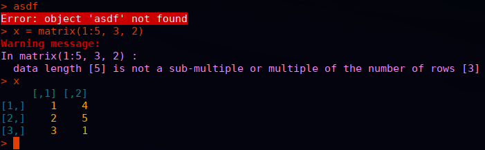
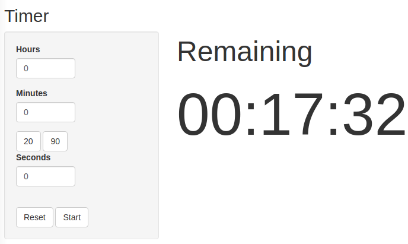

I'll warn you right off the bat, this is going to be an unusual list. Maybe I'm just an unusual guy. For sure there are some packages here that you've heard of. But I'm also pretty sure that there are some you haven't.

Most of these are packages I use on a daily basis, with a few on a weekly basis. There are a few that I don't use that often, but I consider them categorically the best at what they do and sometimes I do those things.

I'm not going to list core/recommended packages like stats, utils, methods, or Matrix. They're all great and I use them all the time. But in my mind, they're just part of R itself. I'm also going to split these into two groups: packages I didn't write and packages I did. I don't think I'm particularly egotistical about the packages I wrote. If you don't like them or don't want to use them, that's fine. But I wrote them for a reason, and they solve real problems I have.

Let's start with packages I didn't write:

## Other Peoples' Packages

### colorout

My number one favorite package, whose absence I *immediately* feel, is the [colorout package](https://github.com/jalvesaq/colorout). Basically, it makes the R terminal output different colors so you can immediately visually recognize what you're looking at. For examples, errors are colored red. It used to be on CRAN, but was removed for what is in my opinion a very dubious rule from CRAN. But it is still actively maintained, and I refuse to use R without it.



I have used colorout for over a decade. I have used it on desktops, laptops, at least one netbook, order of 10 supercomputers, various AWS EC2 boxes, a bunch of web servers, my [pi-hole](https://pi-hole.net/) and a chromebook that runs Linux. For me wherever R goes, colorout goes too.

While we're at it, although not an R package, this is something else that I categorically refuse to operate without. In my `~/.bashrc` I set this alias

```
alias R='R --no-save --no-restore --quiet'
```

When R starts, I don't want a giant wall of text critting me for 1k damage. I don't want to be asked if I'm REALLY REALLY SURE I want to quit when I exit the damn thing. And I *absolutely do not ever* want my workspace serialized. Everyone spent *years* whining about `stringsAsFactors` on twitter, but this silliness is radically more obnoxious in my estimation. R core should make this behavior the default. #TeamNoSaveNoRestore

### renv

Next, there is the [renv package](https://cran.r-project.org/package=renv). If I had created this list a week ago, I don't know that this package would have made the cut; and if I were to make it a few months from now, I might forget about it. Not that I ever had anything against it, but I think of this kind of infrastructure like an airbag in a car. You sort of forget it's there until it saves your life. And it recently just saved my life.

Lately I've been working on a project that has many dependencies, and the authors use renv to manage that. Prior to working with it, I always felt like "oh renv, yeah that seems nice, but I don't really need it". Well, this project *needs* renv. And recently, one of this project's GitHub package dependencies disappeared. Poof, gone from the internet forever. Amazingly, renv caches the source packages before installing them. So we were able to copy the source files of the dead package cloned by renv to a new GitHub repo, and everything was fine. Hooray!

### ggplot2

Everyone knows about [ggplot2](https://cran.r-project.org/package=ggplot2). I largely don't like the "tidyverse". I don't like the name (both "tidy" and "verse" make my eyes roll into the back of my head), and most of these "tidy" packages (dplyr in particular) solve problems I don't have with solutions that don't make any sense to me. SQL has destroyed some of you peoples' brains. But ggplot2 is something special to me. Any time I need to make a plot, it's some obnoxiously custom thing that base R graphics can't begin to handle, but ggplot2 does beautifully.


Look at that plot. It's exactly what I want. It's beautiful. The code to generate it is a little verbose and ugly, but so what. The outcome justifies the process.

If you've never read it, I think it's worth looking at the foundation of ggplot, namely Leland Wilkinson's [Grammar of Graphics book](https://link.springer.com/book/10.1007/0-387-28695-0). A lot of the book is kind of made irrelevant by R itself (read it and you'll see what I mean). But I would still recommend at least thumbing through the book, assuming you can get a copy from your local library or sketchy Russian pdf website.

### remotes

If you want to install a package from R with something other than `install.packages()`, then remotes will do it. In fact, I found I was typing `remotes::install_github()` so often that I aliased it to `getgh()` in my `~/.Rprofile`.

### rhub

If you do R package development and you aren't using the [rhub package](https://cran.r-project.org/package=rhub), you are making your life way harder than it needs to be. Test your software on all the strange, exotic operating systems that you don't normally have access to. Like Windows.


## Packages I Wrote

I'm separating these from the others because I don't know how useful these are to most people. I've written or made significant contributions to many R packages, probably over 100. These aren't even necessarily the ones I'm most proud of (fmlr is an exception). But these are packages that I use *a lot*. 

### timer

You're not going to believe me, but I use the [timer package](https://github.com/wrathematics/timer) more than any other R package. What does it do? Well, it's a timer. I use the "count down" timers for cooking. For example, I cook my bread in the oven for 20 minutes, so I'll run `minutes(20)`. I also use the "count up" timer (basically a stop watch) in the gym for rest sets. For that I run `counter()`. I have a friend that uses this for meetings; for that, he likes to use the `alarm()` function, which accepts a time of day as a string.

When I need multiple timers, I just use multiple terminals each with an R session. The package also has a shiny app so you can do it from a web browser. For that you can run `timer::webtimer()`.



### memuse

Using the [memuse package](https://cran.r-project.org/package=memuse), I settle a staggering amount of arguments by typing:

```r
memuse::howbig(m, n)
```

What does it do? It tells you how much RAM you need for an m by n numeric matrix (so double precision). If you want float, you can add the argument `type="float"`, or just do `howbig(m, n)/2`. It really works quite well.

The package also has a bunch of ways to query system information, like `Sys.meminfo()` which tells you how much RAM you have. These all work on Linux, Windows, Mac, and FreeBSD.

```r
Sys.meminfo()
## Totalram:  62.814 GiB 
## Freeram:   42.685 GiB 
Sys.swapinfo()
## Totalswap:     2.000 GiB 
## Freeswap:      1.989 GiB 
## Cachedswap:  468.000 KiB 
```

We can also see how much memory your current R session is using:

```r
Sys.procmem()
## Size:  69.383 MiB 
## Peak:  69.383 MiB 
howbig(10000, 10000)
## 762.939 MiB
x = matrix(0, nrow=10000, ncol=10000)
rm(x)
invisible(gc())
Sys.procmem()
## Size:   71.719 MiB 
## Peak:  834.559 MiB 
```

I even have cache lookups, which I forgot about until just now:

```r
Sys.cachesize()
## L1I:   64.000 KiB 
## L1D:   32.000 KiB 
## L2:   512.000 KiB 
## L3:    16.000 MiB 
Sys.cachelinesize()
## Linesize:  64 B 
```

### merkhet

Like apparently everyone else, I wrote my own benchmarking package. I call mine [merkhet](https://hpcran.org/packages/merkhet/index.html), which is the name of an ancient Egyptian timekeeping device.

Here's an example of how it works:

```r
b = merkhet::bench("My example benchmark")

b$time(Sys.sleep(.5), reps=3, name="fast op")
b$time(Sys.sleep(1), reps=1, name="slow op")

b
## ## My example benchmark 
##         elapsed reps       avg relative
## fast op   1.501    3 0.5003333      1.5
## slow op   1.002    1 1.0020000      1.0
```

This solves two main problems I have with other benchmarkers:
1. Sometimes I want to run different operations at different numbers of reps (e.g. more fast ops than slow ops)
2. Sometimes I want to *conditionally* benchmark something. For example, only benchmark a GPU operation if the package has been built with GPU support.

It also solves a few other minor problems I have with benchmarkers. Like, it should be *really easy* to set the names of what I'm benchmarking. I also don't want to futz around with the time unit. For evaluating an R expression, I believe very strongly that the correct unit is seconds.

The benchmark method offers a few other handy things I've seen in other benchmarkers like the `barplot()` method which you may be surprised to learn, creates barplots. But I also offer a few other handy things like this:

```r
tbl = b$table()
str(tbl)
## 'data.frame':	2 obs. of  5 variables:
##  $ operation: Factor w/ 2 levels "fast op","slow op": 1 2
##  $ elapsed  : num  1.5 1
##  $ reps     : num  3 1
##  $ avg      : num  0.501 1.001
##  $ relative : num  1.5 1
```

and this

```r
b$csv()
## expr,elapsed,reps,avg,relative
## "fast op",1.502,3,0.5006667,1.5
## "slow op",1.001,1,1.001,1

```

The package has some other utilities you may or may not care about, like this

```r
readable.time(2500)
## 41.667 minutes 
```

### fmlr

I've shown this package off a few times on this blog. And basically it's the reason this blog exists. But I still need to talk about this on its own at some point.

Anyway, these days when I need to do something with matrix computing, I use [fmlr package](https://hpcran.org/packages/fmlr/index.html). More on that later I guess.
